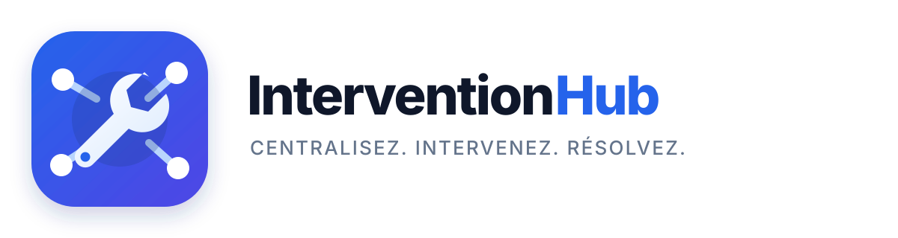

<p align="center">
    
</p>

<h1 align="center">InterventionHub</h1>

<p align="center">
    Plateforme web de gestion et de suivi des interventions techniques.
</p>

<p align="center">
    <a href="https://github.com/TEKIMADJE/InterventionHub/actions/workflows/ci.yml">
        
    </a>
</p>

## Présentation

InterventionHub est une plateforme web permettant de centraliser les demandes d’intervention technique, d’affecter les techniciens, de suivre l’avancement des travaux et d’informer les utilisateurs concernés.

Le projet a été réalisé dans le cadre d’un stage de développement web. Il répond au besoin d’une entreprise souhaitant remplacer une gestion dispersée des demandes techniques par un système centralisé, sécurisé et traçable.

## Objectifs

- Centraliser les demandes d’intervention.
- Faciliter l’affectation des techniciens.
- Suivre le cycle de vie d’une intervention.
- Conserver un historique des modifications.
- Améliorer la communication entre les utilisateurs.
- Envoyer des notifications aux personnes concernées.
- Sécuriser les accès selon les rôles.

## Fonctionnalités principales

### Authentification

- Création de compte Client.
- Connexion et déconnexion.
- Vérification de l’adresse email.
- Réinitialisation du mot de passe par email.
- Modification du profil et du mot de passe.
- Désactivation des comptes.
- Redirection automatique selon le rôle.

### Gestion des utilisateurs

L’administrateur peut :

- consulter les utilisateurs ;
- rechercher et filtrer les comptes ;
- créer un utilisateur ;
- modifier ses informations ;
- attribuer un rôle ;
- activer ou désactiver un compte ;
- consulter les profils.

### Gestion des interventions

- Création d’une demande par un client.
- Génération automatique d’une référence.
- Catégorie, priorité, statut et localisation.
- Affectation d’un technicien par le responsable.
- Mise à jour du statut par le technicien.
- Ajout obligatoire d’un compte rendu avant clôture.
- Enregistrement des dates de démarrage et de clôture.
- Recherche et filtrage des interventions.
- Historique des modifications.

### Commentaires

- Échanges entre les utilisateurs concernés.
- Contrôle d’accès à chaque intervention.
- Notifications lors d’un nouveau commentaire.
- Suppression par l’auteur ou l’administrateur.

### Pièces jointes

- Ajout de plusieurs fichiers.
- Formats autorisés : JPG, JPEG, PNG, PDF, DOC et DOCX.
- Taille maximale contrôlée.
- Téléchargement sécurisé.
- Suppression par l’auteur ou l’administrateur.
- Accès limité aux utilisateurs concernés.

### Notifications

- Nouvelle demande d’intervention.
- Affectation ou remplacement d’un technicien.
- Changement de statut.
- Clôture d’une intervention.
- Nouveau commentaire.
- Compteur de notifications non lues.
- Actualisation automatique sans rechargement manuel.
- Marquage d’une notification comme lue.

## Rôles

| Rôle | Responsabilités |
|---|---|
| Administrateur | Gère les utilisateurs, les interventions et la plateforme |
| Responsable technique | Supervise les demandes et affecte les techniciens |
| Technicien | Consulte ses missions, met à jour leur statut et ajoute une solution |
| Client | Crée des demandes et suit leur traitement |

## Cycle d’une intervention

```text
Client
  → crée une demande
  → Responsable technique notifié
  → affecte un technicien
  → Technicien et Client notifiés
  → Technicien démarre l’intervention
  → échanges par commentaires et fichiers
  → Technicien ajoute la solution
  → clôture l’intervention
  → Client notifié
```

## Technologies utilisées

### Backend

- PHP 8.2
- Laravel 12
- Laravel Breeze
- Eloquent ORM
- Notifications Laravel
- Pest / PHPUnit

### Frontend

- React 18
- Inertia.js 2
- Tailwind CSS
- Vite
- Headless UI
- Font Awesome

### Base de données et outils

- MySQL
- SQLite en mémoire pour les tests
- Git et GitHub
- GitHub Actions
- Composer
- npm
- XAMPP
- Visual Studio Code

## Architecture

Le projet suit une architecture inspirée du modèle MVC :

```text
app/
├── Http/
│   ├── Controllers/
│   └── Middleware/
├── Models/
└── Notifications/

database/
├── migrations/
├── seeders/
└── factories/

resources/js/
├── Components/
├── Layouts/
└── Pages/

routes/
├── web.php
└── auth.php

tests/
├── Feature/
└── Unit/
```

Les pages React communiquent avec Laravel grâce à Inertia.js. Les données sont manipulées avec les modèles Eloquent et stockées dans MySQL.

## Prérequis

Avant l’installation, vérifier la présence de :

- PHP 8.2 ou supérieur ;
- Composer 2 ;
- Node.js 22 ou supérieur ;
- npm ;
- MySQL ;
- extensions PHP nécessaires : PDO, Mbstring, OpenSSL, Fileinfo et Zip.

## Installation locale

### 1. Cloner le dépôt

```bash
git clone https://github.com/TEKIMADJE/InterventionHub.git
cd InterventionHub
```

### 2. Installer les dépendances PHP

```bash
composer install
```

### 3. Créer le fichier d’environnement

Sous Windows :

```powershell
Copy-Item .env.example .env
```

Sous Linux ou macOS :

```bash
cp .env.example .env
```

### 4. Générer la clé Laravel

```bash
php artisan key:generate
```

### 5. Configurer MySQL

Modifier les valeurs suivantes dans `.env` :

```env
DB_CONNECTION=mysql
DB_HOST=127.0.0.1
DB_PORT=3306
DB_DATABASE=interventionhub
DB_USERNAME=root
DB_PASSWORD=
```

Créer ensuite la base de données `interventionhub`.

### 6. Exécuter les migrations et les données de référence

```bash
php artisan migrate --seed
```

### 7. Créer le lien de stockage

```bash
php artisan storage:link
```

### 8. Installer les dépendances JavaScript

```bash
npm install
```

### 9. Compiler le frontend

Pour le développement :

```bash
npm run dev
```

Pour la production :

```bash
npm run build
```

### 10. Démarrer l’application

```bash
php artisan serve
```

L’application sera accessible à l’adresse :

```text
http://127.0.0.1:8000
```

## Comptes de démonstration

Les comptes fictifs peuvent être créés volontairement avec :

```bash
php artisan db:seed --class=DemoUserSeeder
```

| Rôle | Email | Mot de passe |
|---|---|---|
| Administrateur | `admin@interventionhub.test` | `Demo@2026` |
| Responsable | `manager@interventionhub.test` | `Demo@2026` |
| Technicien | `technician@interventionhub.test` | `Demo@2026` |
| Client | `client@interventionhub.test` | `Demo@2026` |

> Ces comptes sont réservés aux tests et aux démonstrations. Ils ne doivent pas être utilisés tels quels dans un environnement de production.

## Configuration des emails

Les paramètres SMTP doivent être définis uniquement dans `.env` :

```env
MAIL_MAILER=smtp
MAIL_HOST=
MAIL_PORT=
MAIL_USERNAME=
MAIL_PASSWORD=
MAIL_ENCRYPTION=tls
MAIL_FROM_ADDRESS=
MAIL_FROM_NAME="${APP_NAME}"
```

Le fichier `.env` ne doit jamais être envoyé sur GitHub.

## Tests

Exécuter toute la suite :

```bash
php artisan test --do-not-cache-result
```

État actuel de la V1 :

```text
43 tests réussis
142 assertions validées
```

Les tests couvrent notamment :

- authentification ;
- inscription ;
- vérification d’email ;
- réinitialisation du mot de passe ;
- création d’intervention ;
- affectation d’un technicien ;
- traitement et clôture ;
- commentaires ;
- pièces jointes ;
- notifications ;
- sécurité des routes et des rôles.

## Intégration continue

Le workflow GitHub Actions situé dans :

```text
.github/workflows/ci.yml
```

exécute automatiquement à chaque push et pull request :

1. l’installation de PHP et Node.js ;
2. l’installation des dépendances ;
3. les audits de sécurité Composer et npm ;
4. la compilation du frontend ;
5. les tests Laravel.

## Sécurité

InterventionHub applique notamment :

- authentification obligatoire ;
- vérification des adresses email ;
- autorisation selon le rôle ;
- blocage des comptes désactivés ;
- contrôle d’accès aux interventions ;
- validation des formulaires ;
- mots de passe hachés ;
- restrictions sur les fichiers ;
- protection CSRF ;
- variables sensibles conservées dans `.env`.

## État du projet

La version V1 est fonctionnelle et stabilisée.

### Réalisé

- fonctionnalités métier principales ;
- quatre espaces utilisateurs ;
- interface responsive ;
- sécurité des accès ;
- tests automatisés ;
- audits de dépendances ;
- intégration continue GitHub Actions.

### Étapes suivantes

- déploiement de démonstration ;
- configuration selon l’infrastructure de l’entreprise ;
- sauvegardes automatiques ;
- véritable temps réel avec WebSockets ;
- amélioration des rapports et statistiques ;
- documentation utilisateur ;
- préparation de la soutenance.

## Auteur

**Tekimadje Jean Chrysostome**

Étudiant en Intelligence Artificielle et Technologies Émergentes  
École Supérieure de Technologie de Meknès

GitHub : [TEKIMADJE](https://github.com/TEKIMADJE)

## Contexte

Projet réalisé dans le cadre d’un stage académique portant sur la conception et le développement d’une plateforme de gestion des interventions techniques.